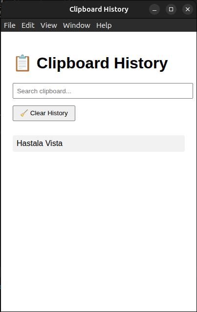

# 📋 Clipboard Watcher App

A simple cross-platform Electron desktop application that monitors clipboard changes, shows notifications, stores clipboard history, and optionally blocks sensitive content.

 <!-- Optional: replace with actual screenshot -->

---

## ✨ Features

- 🔍 Real-time clipboard monitoring
- 📝 View clipboard history in a GUI
- 🔔 Desktop notifications via `node-notifier`
- 💾 Save logs of clipboard history to a file
- 🔒 Block certain keywords (e.g., passwords, secrets)
- 🧰 System tray integration (icon-based controls)
- 📦 Linux `.deb` package support

---

Here’s the corrected and polished version of your `🚀 Getting Started` section:

---

## 🚀 Getting Started

If you prefer not to go through the setup and build steps yourself—no worries, I’ve got you covered!

Simply navigate to the `Install-build-directly` folder. You’ll find a prebuilt `.deb` installer ready to use.

To install the application, run the following command:

```bash
sudo dpkg -i Install-build-directly/clipboard-watcher-app_1.0.0_amd64.deb
```

If you encounter any missing dependency errors, you can fix them by running:

```bash
sudo apt --fix-broken install
```

### 🛠 Prerequisites

- **Node.js** (v18 or newer)
- **npm** (v9 or newer)
- **Electron** and **Electron Builder**
- Linux (Ubuntu or Debian for `.deb` builds)

### 📦 Install Dependencies

```bash
git clone https://github.com/roopesh/clipboard-watcher-app.git
cd clipboard-watcher-app
npm install
```

### ▶️ Run in Development Mode

```bash
npm start
```

---

## 📁 Project Structure

```
clipboard-watcher-app/
├── main.js              # Main Electron process
├── preload.js           # Optional preload for renderer isolation
├── index.html           # GUI HTML file
├── renderer.js          # GUI JS file (optional)
├── tray.png             # Tray icon
├── logs/                # Clipboard logs (auto-created)
├── package.json         # App metadata and scripts
└── README.md            # You are here
```

---

## 📦 Build for Distribution

Build a `.deb` installer for Linux:

```bash
npm run dist
```

The output `.deb` will be created in the `dist/` directory.

## 📦 Install the application

Install using following command:

```bash
sudo dpkg -i dist/clipboard-watcher-app_1.0.0_amd64.deb 
```
---

## 📜 Clipboard History GUI (index.html)

You can view the clipboard history in a simple HTML interface:

* Automatically updates on copy
* Includes a clear history button
* Shows time of each clipboard entry

---

## 📂 Logs

Clipboard entries are logged to a file located at:

```
logs/clipboard-log.txt
```

You can change or disable logging in `main.js`.

---

## 🚫 Keyword Blocking

To block specific content (e.g., confidential text), edit the `BLOCKED_KEYWORDS` array in `main.js`:

```js
const BLOCKED_KEYWORDS = ['password', 'secret', 'token'];
```

If any clipboard content includes one of these words, it will be blocked and not stored/logged.

---

## 🧪 Development Notes

* Tray support requires `tray.png` to be available
* Desktop notifications use `node-notifier` (supports macOS, Linux, Windows)
* Electron version: `^36.3.2`

---

## 🛠 Configuration (`package.json`)

```json
"build": {
  "appId": "com.roopesh.clipboardwatcher",
  "productName": "ClipboardWatcher",
  "files": ["**/*"],
  "linux": {
    "target": "deb",
    "category": "Utility",
    "maintainer": "Roopesh <roopesh@example.com>",
    "icon": "tray.png"
  }
}
```

---

## 🤝 Contributing

Contributions are welcome!

1. Fork the repository
2. Create a new branch (`git checkout -b feature/your-feature`)
3. Commit your changes (`git commit -am 'Add new feature'`)
4. Push to the branch (`git push origin feature/your-feature`)
5. Create a pull request

---

## 📧 Author

**Roopesh**
📫 Email: [rsroopesh565@gmail.com](mailto:rsroopesh565@gmail.com)

---

## 🧾 License

This project is licensed under the [MIT License](LICENSE).

---

## 🔗 Resources

* [Electron Documentation](https://www.electronjs.org/docs)
* [node-notifier](https://github.com/mikaelbr/node-notifier)
* [Electron Builder Config](https://www.electron.build/configuration/configuration)

---

## ✅ TODO / Ideas

* [ ] Search clipboard history
* [ ] Export clipboard history
* [ ] Dark mode toggle
* [ ] Hotkey to toggle history panel
* [ ] Configurable blocked keywords (via settings GUI)

## Hastala Vista 